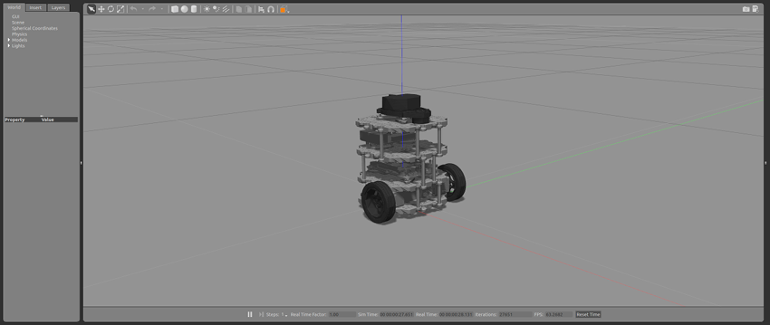

# Симуляция TurtleBot3 в Gazebo (ROS 2 Humble)

**Примечание:** Симуляцию следует запускать с **Remote PC**. При первом запуске может потребоваться дополнительное время на настройку окружения.

---

## Содержание

- [Предварительные требования](#предварительные-требования)
- [Установка пакетов симуляции](#установка-пакетов-симуляции)
- [Запуск миров симуляции](#запуск-миров-симуляции)
  - [Empty World](#empty-world)
  - [TurtleBot3 World](#turtlebot3-world)
  - [TurtleBot3 House](#turtlebot3-house)
- [Управление TurtleBot3](#управление-turtlebot3)
  - [Телеуправление с клавиатуры](#телеуправление-с-клавиатуры)
  - [Автономное движение с избеганием препятствий](#автономное-движение-с-избеганием-препятствий)
- [Визуализация данных в RViz2](#визуализация-данных-в-rviz2)

---

## Предварительные требования

Убедитесь, что установлены:
- ROS 2 Humble
- Gazebo (совместимая версия)
- Пакеты `turtlebot3` и `turtlebot3_msgs` (следуйте инструкциям [PC Setup](https://emanual.robotis.com/docs/en/platform/turtlebot3/quick-start/))

---

## Установка пакетов симуляции

```bash
cd ~/turtlebot3_ws/src/
git clone -b humble https://github.com/ROBOTIS-GIT/turtlebot3_simulations.git
cd ~/turtlebot3_ws && colcon build --symlink-install
source ~/turtlebot3_ws/install/setup.bash
```

---

## Запуск миров симуляции

### Empty World

Пустой мир без препятствий.



```bash
export TURTLEBOT3_MODEL=burger
ros2 launch turtlebot3_gazebo empty_world.launch.py
```

### TurtleBot3 World

Мир с простыми препятствиями, подходящий для тестирования навигации.


```bash
export TURTLEBOT3_MODEL=waffle
ros2 launch turtlebot3_gazebo turtlebot3_world.launch.py
```

### TurtleBot3 House

Дом с комнатами и коридорами. При первом запуске карта может загружаться несколько минут.


```bash
export TURTLEBOT3_MODEL=waffle_pi
ros2 launch turtlebot3_gazebo turtlebot3_house.launch.py
```

---

## Управление TurtleBot3

### Телеуправление с клавиатуры

В новом терминале запустите ноду управления:

```bash
ros2 run turtlebot3_teleop teleop_keyboard
```

### Автономное движение с избеганием препятствий

1. Завершите ноду телеуправления (`Ctrl+C`).
2. Запустите ноду автономного вождения:

```bash
ros2 run turtlebot3_gazebo turtlebot3_drive
```

Робот будет объезжать препятствия, сохраняя безопасную дистанцию.

---

## Визуализация данных в RViz2

Пока симуляция активна, откройте RViz2 для отображения сенсорных данных:

```bash
ros2 launch turtlebot3_bringup rviz2.launch.py
```


---

## Примечания

- Все команды выполняются после `source` рабочего окружения.
- Перед запуском нового мира обязательно закройте предыдущий (завершите процесс Gazebo).
- Подробнее о симуляции: [TurtleBot3 Simulation](https://emanual.robotis.com/docs/en/platform/turtlebot3/simulation/).
