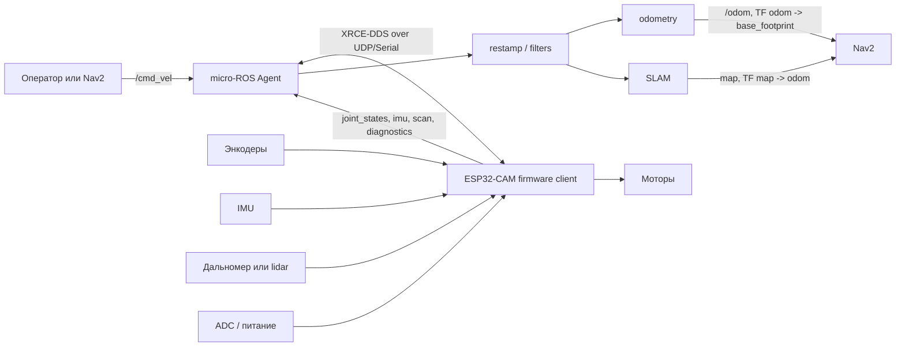

# micro-ROS в стеке ESP32-CAM робота

В этой главе показано, какое место micro-ROS занимает в системе мобильного робота. ESP32-CAM читает датчики и управляет моторами, а компьютер с ROS 2 запускает Agent, одометрию, TF, SLAM, Nav2 и инструменты диагностики.

В командах курса используются примерные имена пакетов и launch-файлов. В своем проекте замените их на реальные имена workspace, firmware-проекта и ROS 2 пакетов.

## Где micro-ROS находится в системе

Обычная ROS 2 система рассчитана на Linux-компьютеры: ноутбук, Raspberry Pi, Jetson или промышленный ПК. Но часть задач мобильного робота удобнее держать на микроконтроллере:

- читать энкодеры, IMU, ADC и дальномер;
- управлять моторами с коротким периодом цикла;
- держать безопасное состояние при потере связи;
- включать и выключать питание датчиков;
- отправлять в ROS 2 уже готовую телеметрию.

micro-ROS связывает эти уровни:

- **micro-ROS Client** - firmware на микроконтроллере с `rcl`, `rclc`, publishers, subscriptions и executor;
- **transport** - UDP, serial, USB CDC или другой канал связи;
- **micro-ROS Agent** - процесс на компьютере, который переводит XRCE-DDS обмен клиента в обычный ROS 2 graph.

Для остальных ROS 2 нод микроконтроллер выглядит как обычная нода: он публикует топики, принимает команды и виден через `ros2 node list`.

Полезные источники:

- [micro-ROS documentation](https://micro.ros.org/docs/overview/features/)
- [micro-ROS Agent](https://github.com/micro-ROS/micro-ROS-Agent)
- [micro_ros_espidf_component](https://github.com/micro-ROS/micro_ros_espidf_component)

## Архитектура ESP32-CAM робота

Типовая схема для маленького дифференциального робота:

Разделение ответственности:

- ESP32-CAM отвечает за близкую к железу часть: моторы, сенсоры, питание, timeout команд.
- Компьютер с ROS 2 отвечает за тяжелые алгоритмы: TF, SLAM, локализацию, Nav2, RViz, запись данных.
- Agent связывает эти два уровня и дает обычным ROS 2 инструментам доступ к микроконтроллеру.

Похожую аппаратную базу можно собрать на готовой машинке с ESP32-CAM, например на [Keyestudio ESP32 Vision smart car](https://www.ozon.ru/product/keyestudio-umnaya-mashina-esp32-vision-dlya-robota-arduino-s-kameroy-esp32-2728883926/?at=79tn0BxogC19qJ5CE0GW5NhmKnXwVhP3p0j7uXoP731).

## Резюме

micro-ROS нужен там, где ROS 2 должен дотянуться до микроконтроллера, но не переносить на него тяжелые алгоритмы. Микроконтроллер остается рядом с моторами и сенсорами, Agent делает его частью ROS 2 graph, а хостовая система уже строит odometry, TF, SLAM и Nav2.

## Следующий шаг

Переходите к [ROS-контракту микроконтроллера](micro_ros_contract.md): там нужно заранее договориться, какие топики, типы сообщений, QoS и `frame_id` будет публиковать firmware.
