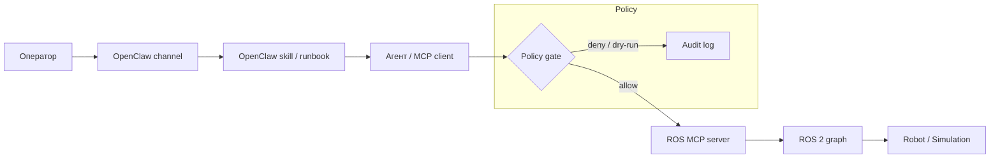

# ROS 2, MCP и OpenClaw: зачем писать свой сервер, когда есть готовые

Если вы гоняете ROS 2 Humble или Jazzy и пытаетесь подружить робота с LLM-агентом, рано или поздно вы натыкаетесь на MCP.

Поговорим про границы. MCP не заменяет ROS 2, не заменяет Nav2, не заменяет MoveIt 2, не заменяет ros2_control и DDS. Он не лезет в реал-тайм контур, не трогает control loop, не подменяет tf2. MCP — это просто протокол, по которому LLM-агент получает ограниченный, типизированный доступ к части ROS 2 graph: вызвать сервис, дёрнуть action, прочитать топик. OpenClaw сверху — это операторский слой: канал связи (Telegram, Slack, веб-чат), runbook в виде skill, scheduled diagnostics, вебхуки, подтверждения от человека. ROS 2 как был, так и остаётся системой управления и единственным источником истины о состоянии робота. Агент — гость, а не хозяин этого графа.

## Что такое MCP и как это работает технически

MCP (Model Context Protocol) — это протокол, который решает одну конкретную проблему: как LLM-агенту дёргать внешние системы стандартизированным способом, без того, чтобы каждый раз писать кастомную интеграцию под каждый API. Механика простая и состоит из трёх ролей.

**MCP server** — процесс, который держит соединение с реальной системой (в нашем случае — с ROS 2 graph через `rclpy` или `rclnodejs`) и экспонирует наружу список **tools**. Каждый tool — это JSON Schema с именем, описанием на естественном языке и типизированными параметрами. Например, tool `navigate_to_waypoint` может иметь схему `{waypoint_id: string, dry_run: boolean}` и описание «отправляет робота к именованной точке на карте». Сервер сам решает, что происходит внутри вызова — может быть прямой `rclpy` service call, может быть запуск action и ожидание результата, может быть просто чтение последнего сообщения из топика.

**MCP client** — это то, что живёт на стороне агента (хост-приложение типа Claude Desktop, IDE, или ваш собственный orchestration слой). Клиент подключается к одному или нескольким MCP servers, получает от них список доступных tools со схемами и отдаёт этот список языковой модели как часть контекста. Дальше модель сама решает, какой tool вызвать и с какими параметрами — это обычный function calling, просто унифицированный протоколом MCP.

**Transport** — то, как client и server физически общаются. Два основных варианта: `stdio` (сервер — локальный процесс, общение через stdin/stdout, удобно для разработки и для тех случаев, когда MCP server и агент крутятся на одной машине или одном роботе) и `HTTP/SSE` (сервер — сетевой сервис, можно держать MCP server на самом роботе или рядом с ним, а агента — где угодно, общение идёт по сети с server-sent events для стриминга ответов). Для робота с ограниченными ресурсами `stdio` локально на борту — вариант проще и без лишней сетевой поверхности атаки.

Важная деталь: MCP server не содержит интеллекта. Он не решает, безопасно ли выполнять команду — это либо ответственность policy gate (отдельный слой, который мы опишем ниже), либо самих ROS 2 nodes, у которых уже есть свои проверки. MCP server — это просто типизированная дверь между агентом и графом нод, ничего не скрывающая по умолчанию, кроме того, что вы явно не экспонировали как tool.

## Что такое OpenClaw

OpenClaw — это не замена ROS 2 и не MCP-имплементация, а слой выше: оркестрация агента вокруг каналов связи с человеком и операционных процедур. Если MCP отвечает на вопрос «как агент технически вызывает функцию во внешней системе», то OpenClaw отвечает на вопрос «как агент работает как оператор смены»: откуда приходят сообщения (Telegram-бот, Slack-канал, веб-чат, вебхук от внешней системы мониторинга), какие у агента есть skills — то есть написанные на естественном языке runbook'и, которые говорят, что делать в той или иной ситуации, — и как агент сообщает результат обратно человеку.

Практически OpenClaw — это среда выполнения, в которой крутится агент с подключенными MCP servers, набором `SKILL.md` файлов и конфигурацией каналов. Кто-то пишет оператору в Telegram «проверь батарею у робота на складе Б» — OpenClaw принимает сообщение, агент внутри него читает релевантный skill, видит, что вызов `get_battery_status` безопасен и не требует подтверждения, дёргает MCP tool, получает ответ и форматирует его обратно в чат на человеческом языке. Если бы вместо проверки батареи оператор попросил «отправь робота на докстанцию», агент сверился бы с тем же skill, увидел требование supervisor validation, и вместо немедленного вызова tool отправил бы в тот же канал запрос на подтверждение.

Отдельная важная часть OpenClaw — scheduled diagnostics и вебхуки: агент не обязательно ждёт сообщения от человека, он может сам по таймеру дёргать `get_diagnostics` каждые N минут и писать в канал, если что-то пошло не так, или принимать вебхук от внешней системы (например, алерт от мониторинга батарей) и реагировать на него тем же способом, как на сообщение оператора. Для робототехники это удобно именно потому, что снимает с человека необходимость постоянно проверять статус вручную — агент становится дежурным, который знает, когда можно действовать сам, а когда обязан спросить.

## Архитектура, которая реально работает

Рабочая схема в проде выглядит линейно, но с обязательным policy gate посередине:



Policy gate — это не абстракция для красоты, а конкретный набор проверок между «агент решил вызвать tool» и «tool реально дернул ROS 2 API»: dry-run режим по умолчанию для всего, что двигает актуаторы; лимиты на скорость, дистанцию, частоту вызовов; supervisor validation для команд, помеченных как опасные; и audit log, который пишет каждый вызов с параметрами и результатом, даже если вызов был отклонён. Без этого слоя агент с доступом к `/cmd_vel` или к manipulation action — это не помощник, а способ уронить робота с лестницы по первой же глюканувшей генерации токенов.

Главное правило простое: агент никогда не получает raw actuator surface. Не топик `/cmd_vel` напрямую, не joint commands, не raw gripper control. Только typed tools с осмысленными границами — `move_to_named_pose`, `navigate_to_waypoint`, `set_max_velocity`, — где сама сигнатура tool уже исключает половину возможных факапов.

## Почему свой MCP server — это нормально, и часто лучше

Здесь главный тезис: для конкретного робота свой небольшой MCP server почти всегда надёжнее, чем попытка натянуть универсальную готовую обёртку. Причина простая — универсальный сервер пытается покрыть все роботы и поэтому экспонирует tools широко: «вызвать любой сервис по имени», «опубликовать в любой топик», «вызвать любой action». Это удобно для демо и неудобно для продакшна, потому что вы теряете контроль ровно там, где он нужнее всего — на границе между LLM и физическим миром.

Свой сервер — это небольшой инфраструктурный проект. Реалистичный объём: 5–10 typed tools поверх уже существующих ROS 2 топиков, сервисов и actions, которые у вас уже есть и уже протестированы. Python-процесс на `rclpy` или TypeScript на `rclnodejs`, который держит ROS 2 node внутри себя и экспонирует через MCP transport (stdio или SSE) узкий набор операций конкретно под ваш стенд. Например, для дифф-драйв робота на складе это может быть: `get_robot_pose`, `navigate_to_waypoint(waypoint_id)`, `get_battery_status`, `pause_navigation`, `resume_navigation`, `get_diagnostics`, `dock_to_charger`. Семь tools, каждый — тонкая обёртка вокруг уже существующего ROS 2 API, без новой бизнес-логики внутри MCP server. Вся опасная логика (лимиты скорости, проверки коллизий, авария-стоп) уже живёт в ROS 2 nodes — MCP server её не дублирует, а просто вызывает.

Плюс такого подхода в том, что схема tool описывает именно вашу предметную область, а не абстрактный ROS API. LLM-агенту не нужно знать, что `navigate_to_waypoint` внутри дёргает Nav2 action `navigate_to_pose` — ему нужно знать, что такой tool есть, что он принимает `waypoint_id: string` и возвращает статус навигации. Чем уже и предметнее интерфейс, тем меньше шансов, что агент с этим интерфейсом сделает что-то непредсказуемое.

## OpenClaw skill — это Markdown

OpenClaw skill — это файл `SKILL.md`. Не сервис, не плагин с кодом, не отдельный деплоймент просто структурированный runbook на естественном языке, который объясняет агенту, как себя вести в контексте конкретного робота. В нём фиксируется: какие tools разрешено использовать и в каком порядке, что категорически запрещено, в каких ситуациях обязателен dry-run перед реальным вызовом, какие команды требуют supervisor validation (то есть явного подтверждения человеком в канале), как агенту формулировать ответ оператору, и какие команды нельзя выполнять на real hardware вообще — только в симуляции.

Пример `SKILL.md` для складского робота:

```markdown
---
name: warehouse-bot-ops
description: Операции с навигацией складского робота через ROS 2 MCP server
---

# Warehouse Bot Operations

## Доступные tools
- get_robot_pose — безопасно, можно вызывать без подтверждения
- get_battery_status — безопасно
- get_diagnostics — безопасно
- navigate_to_waypoint(waypoint_id) — требует dry-run перед первым вызовом в сессии
- pause_navigation / resume_navigation — безопасно
- dock_to_charger — требует supervisor validation

## Запрещено
- Вызывать navigate_to_waypoint с waypoint_id вне зоны warehouse_zone_a/b/c
- Запускать dock_to_charger при battery > 80% (нет необходимости, лишний износ)
- Выполнять любые навигационные команды, если get_diagnostics вернул estop_active: true

## Dry-run policy
Перед первым navigate_to_waypoint в сессии вызови tool с параметром dry_run=true
и покажи оператору ожидаемый путь и оценку времени. Двигай робота только
после явного "ок" от оператора в чате.

## Supervisor validation
dock_to_charger всегда требует подтверждения оператора, даже если battery < 20%.
Сформулируй запрос явно: "Робот на {waypoint}, заряд {battery}%, отправляю на
докстанцию — подтверди."

## Формат ответа оператору
Кратко, на русском, без ROS-жаргона. "Робот на точке B-12, едет на склад A,
прибытие ~40 сек" — не "navigate_to_pose action accepted, goal_id: a3f...".

## Real hardware vs simulation
Если переменная окружения ROBOT_ENV=simulation — все ограничения выше можно
ослаблять по запросу оператора для тестов. Если ROBOT_ENV=production — ограничения
действуют без исключений, даже если оператор просит их обойти.
```

Это весь skill. Никакой логики выполнения в нём нет — она вся в MCP server и в ROS 2 nodes. `SKILL.md` — это контракт поведения, который читает агент перед тем, как решить, какой tool вызвать и нужно ли спрашивать разрешения.

## Как поднять первый стенд

Минимальный путь от нуля до рабочего прототипа на симуляции:

1. Возьмите существующий ROS 2 пакет с рабочими топиками/сервисами/actions — необязательно писать новый узел робота, достаточно того, что уже есть (turtlebot3 в Gazebo — нормальная отправная точка).
2. Напишите MCP server на 3–5 tools: позиция, команда движения к точке, статус. Один файл, один rclpy node внутри, stdio transport для локальной отладки.
3. Подключите MCP server к Claude Desktop или любому MCP-совместимому клиенту через конфиг — проверьте, что агент видит tools и может их вызвать вручную, без skill.
4. Напишите минимальный `SKILL.md` с одним правилом: dry-run перед движением. Проверьте, что агент его соблюдает.
5. Добавьте policy gate как отдельный слой в MCP server — даже если это просто `if dry_run: return predicted_path` без реального вызова action.
6. Прогоните smoke test:
   - агент вызывает `get_robot_pose` и получает реальные координаты;
   - агент пытается вызвать навигацию без dry-run — получает отказ от policy gate;
   - агент вызывает навигацию с dry-run — получает план, не двигает робота;
   - оператор подтверждает — робот реально едет;
   - в audit log видны все четыре события с таймстампами.

Если все пять пунктов проходят на симуляции, дальше — перенос на реальный стенд с более жёсткими лимитами и обязательным supervisor validation на всё, что связано с движением.

## Готовые ROS MCP servers как референсы

Прежде чем писать с нуля, стоит посмотреть существующие реализации — не для прямого использования в проде, а как источник паттернов и ускоритель: как люди оформляют tool schemas, как мапят ROS message types на JSON Schema, как обрабатывают async actions через MCP. Стоящие на этот момент:

- `robotmcp/ros-mcp-server` — один из самых полных, хорошая референс-точка по структуре tools.
- `wise-vision/ros2_mcp`
- `kakimochi/ros2-mcp-server`
- `ajtudela/nav2_mcp_server` — узко заточен под Nav2, полезен если вам нужна именно навигация.
- `Yutarop/ros-mcp`
- `publu/RoboRun`
- `binabik-ai/mcp-rosbags` — специфичный кейс: работа с rosbag-записями через MCP, не realtime control.
- `spanchal001/mcp-ros2-logs`
- `araitaiga/rosout_mcp` — обёртка над `/rosout`, удобна для diagnostics-tools.
- `kubja/ros2_turtlebot_mcp_server_tutorial` — учебный, но как стартовая точка для своего стенда на turtlebot3 — рабочий вариант.

Брать любой из них в прод без правок — плохая идея именно потому, что они спроектированы под общий случай. Ограничивайте набор экспонируемых tools под свой робот, выкидывайте всё, что не нужно, добавляйте свой policy gate сверху — и тогда это становится разумной основой, а не риском.

## Реальных OpenClaw-оберток для ROS пока немного

Честно: публичных готовых OpenClaw skills именно под ROS 2 роботов на рынке мало. Обычные ROS MCP servers из списка выше — это MCP servers, не OpenClaw wrappers, и называть их так не стоит — они ничего не знают про OpenClaw, channels, runbooks или supervisor validation, это просто протокольный мост к ROS 2.

Из того, что целится конкретно в OpenClaw-слой — `ROSClaw` (`rosclaw-plugin`) как plugin, который выступает интерфейсом между OpenClaw и ROS-enabled роботами. Это не отдельный архитектурный слой поверх той схемы, что выше, — он просто закрывает часть работы на стороне OpenClaw integration, которую иначе пришлось бы писать руками.

На практике для большинства стендов быстрее и понятнее написать свой `SKILL.md` под конкретного робота и маленький MCP adapter поверх уже существующих ROS 2 интерфейсов, чем искать готовую обёртку, которая совпадёт с вашей конфигурацией железа, топологией топиков и требованиями к safety. Готовые решения — хорошая шпаргалка по паттернам, но контракт между агентом и роботом в итоге пишете вы, и это полдня работы, а не отдельный спринт.
