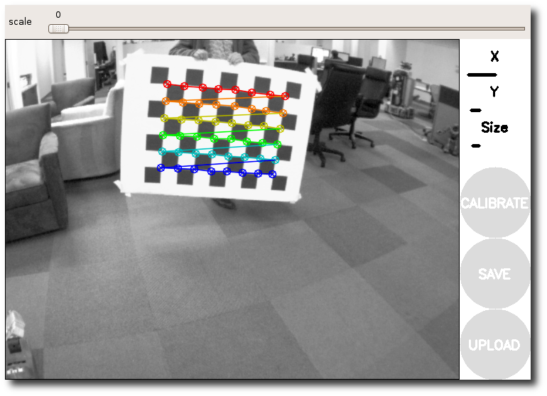
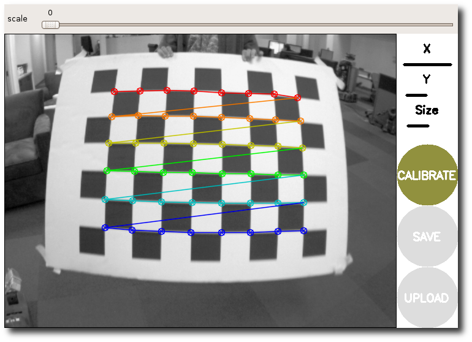
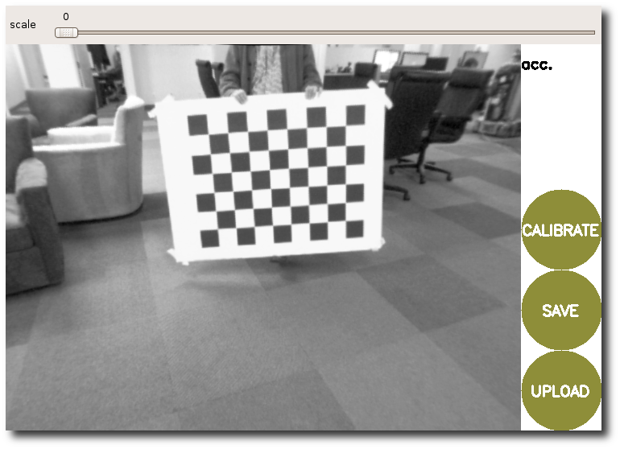

# Калибровка монокулярной камеры в ROS 2

---
## Цель туториала

Получить внутренние параметры камеры и коэффициенты дисторсии, сохранить их в YAML-файл и проверить публикацию сообщения `sensor_msgs/msg/CameraInfo`.

Калибровка определяет:

- матрицу внутренних параметров камеры `K`
- коэффициенты дисторсии `D`
- параметры, необходимые для точной геометрической обработки изображения, измерений и оценки положения объектов

---

## Установка

```bash
source /opt/ros/$ROS_DISTRO/setup.bash

sudo apt update
sudo apt install \
  ros-$ROS_DISTRO-v4l2-camera \
  ros-$ROS_DISTRO-usb-cam \
  ros-$ROS_DISTRO-camera-calibration \
  ros-$ROS_DISTRO-rqt-image-view \
  v4l-utils
```

Пакет `v4l2_camera` используется в основном примере. Пакет `usb_cam` установлен как альтернативный драйвер для камер и режимов, с которыми основной вариант работает нестабильно.

---

## Подключение и проверка камеры

Найдите видеоустройство:

```bash
v4l2-ctl --list-devices
ls -l /dev/video*
```

Посмотрите форматы, разрешения и частоты, которые действительно поддерживает камера:

```bash
v4l2-ctl -d /dev/video0 --list-formats-ext
```

Использовать нужно режим из этого списка. Номер устройства, разрешение и формат у разных камер отличаются.

Пример запуска камеры:

```bash
ros2 run v4l2_camera v4l2_camera_node --ros-args \
  -r __ns:=/camera \
  -p video_device:=/dev/video0 \
  -p image_size:="[640, 480]"
```

Замените `/dev/video0` и `640 × 480` на параметры своей камеры.

Если появляется ошибка:

```text
Failed opening device /dev/video0: Permission denied
```

добавьте текущего пользователя в группу `video`:

```bash
sudo usermod -aG video $USER
```

После этого завершите текущий сеанс пользователя и войдите снова.

Проверьте публикацию изображения:

```bash
ros2 topic list | grep camera
ros2 topic hz /camera/image_raw
ros2 run rqt_image_view rqt_image_view
```

В `rqt_image_view` выберите `/camera/image_raw`

Перед продолжением убедитесь, что изображение отображается без постоянных разрывов, зеленых областей и длительных зависаний. Предупреждение об отсутствующем файле калибровки до выполнения этого урока является ожидаемым.

---

## Особенности работы в WSL2

WSL2 не получает прямой доступ к USB-камере автоматически. Для ее подключения обычно используется `usbipd-win`.

При работе в WSL2 могут возникнуть следующие ситуации:

- камера отсутствует в `/dev/video*`
- доступ к устройству запрещен для текущего пользователя
- камера определяется, но кадры не поступают
- поток содержит зеленые области, разрывы или поврежденные кадры
- фактическая частота заметно ниже заявленной
- автоматическая экспозиция изменяет выдержку и делает поток неравномерным

Возможные направления проверки:

- обновить WSL и `usbipd-win`, затем переподключить USB-устройство
- проверить права на `/dev/video*` и членство пользователя в группе `video`
- выбрать только поддерживаемое камерой сочетание формата, разрешения и частоты
- при нестабильном YUYV попробовать MJPEG через драйвер `usb_cam`
- проверить доступные параметры экспозиции командой `v4l2-ctl --list-ctrls-menus`
- изучить открытые проблемы конкретного драйвера и используемой камеры

Полезные материалы:

- [Подключение USB-устройств к WSL — Microsoft Learn](https://learn.microsoft.com/en-us/windows/wsl/connect-usb)
- [Поддержка WSL в usbipd-win](https://github.com/dorssel/usbipd-win/wiki/WSL-support)
- [Репозиторий и документация usb_cam](https://github.com/ros-drivers/usb_cam)
- [Открытые проблемы usbipd-win](https://github.com/dorssel/usbipd-win/issues)
- [Открытые проблемы usb_cam](https://github.com/ros-drivers/usb_cam/issues)

Основная часть урока предполагает, что камера уже стабильно публикует `/camera/image_raw`.

---

## Подготовка калибровочной доски

Калибратор использует число **внутренних углов**, а не число квадратов.

Например, доска `9 × 7` квадратов содержит `8 × 6` внутренних углов. При стороне квадрата `25 мм` параметры имеют вид:

```text
--size 8x6
--square 0.025
```

Значение `--square` задается в метрах.

Доска должна быть:

- плоской и жесткой;
- хорошо освещенной;
- напечатанной без изменения пропорций;
- измеренной после печати.

---

## Запуск калибратора

Драйвер камеры и калибратор запускаются **параллельно**.

Оставьте драйвер камеры работающим в первом терминале. Во втором терминале выполните:

```bash
source /opt/ros/$ROS_DISTRO/setup.bash

ros2 run camera_calibration cameracalibrator \
  --no-service-check \
  --size 8x6 \
  --square 0.025 \
  image:=/camera/image_raw \
  camera:=/camera
```

Замените `8x6` и `0.025` на параметры своей доски.

Если углы распознаны, калибратор отметит их цветными точками.



---

## Сбор изображений

Медленно перемещайте доску и ненадолго удерживайте ее в каждом положении.

Нужно получить кадры, в которых доска:

- находится слева, справа, сверху и снизу;
- расположена ближе и дальше от камеры;
- наклонена по горизонтали и вертикали;
- занимает разные части изображения;
- полностью видна в кадре.

Индикаторы калибратора показывают разнообразие собранных положений:

- `X` — перемещение по горизонтали;
- `Y` — перемещение по вертикали;
- `Size` — изменение размера доски в кадре;
- `Skew` — изменение ее наклона.

Высокая частота кадров не обязательна. Важнее, чтобы принятые кадры были резкими, целыми и содержали правильно распознанные внутренние углы. Не используйте положения, в которых изображение смазано или повреждено.

Когда данных станет достаточно, кнопка **CALIBRATE** станет активной.



---

## Расчет и оценка результата

Нажмите **CALIBRATE** и дождитесь завершения вычислений.

После расчета в интерфейсе может отображаться показатель `lin.` — ошибка линейности в пикселях. Он показывает остаточное отклонение точек, которые должны располагаться на прямых линиях. Чем ближе значение к нулю, тем меньше остаточная геометрическая ошибка.

Также проверьте изображение визуально и убедитесь, что прямые линии не имеют заметных остаточных изгибов.



Нажмите **SAVE**. Для этого урока кнопка **COMMIT** не обязательна: не каждый драйвер поддерживает сохранение параметров через сервис камеры.

---

## Сохранение параметров

После нажатия **SAVE** путь к архиву будет выведен в терминале. Обычно создается файл `calibrationdata.tar.gz` в каталоге `/tmp`.

Извлеките `ost.yaml`:

```bash
mkdir -p ~/.ros/camera_info /tmp/camera_calibration

rm -rf /tmp/camera_calibration/*

tar -xzf /tmp/calibrationdata.tar.gz \
  -C /tmp/camera_calibration

cp /tmp/camera_calibration/ost.yaml \
  ~/.ros/camera_info/usb_camera.yaml
```

Если терминал показал другой путь к архиву, используйте его вместо `/tmp/calibrationdata.tar.gz`.

---

## Загрузка параметров в драйвер

Перезапустите камеру, передав путь к YAML-файлу:

```bash
ros2 run v4l2_camera v4l2_camera_node --ros-args \
  -r __ns:=/camera \
  -p video_device:=/dev/video0 \
  -p image_size:="[640, 480]" \
  -p camera_info_url:="file://${HOME}/.ros/camera_info/usb_camera.yaml"
```

Разрешение должно совпадать с тем, которое использовалось при калибровке.

Проверьте сообщение `CameraInfo`:

```bash
ros2 topic echo /camera/camera_info --once
```

В матрице `k` должны находиться ненулевые параметры камеры, а массив `d` должен содержать рассчитанные коэффициенты дисторсии.

> Результат калибровки действителен для конкретной камеры, объектива, разрешения и положения фокусировки. При изменении этих условий калибровку следует выполнить заново.

---

## Итог

После выполнения урока:

- камера публикует `/camera/image_raw`
- параметры сохранены в YAML-файле
- топик `/camera/camera_info` содержит матрицу `K` и коэффициенты `D`
- камера подготовлена к задачам, требующим точной геометрии изображения

---

## Внешние источники

- [ROS 2: калибровка монокулярной камеры](https://docs.ros.org/en/jazzy/p/camera_calibration/doc/tutorial_mono.html)
- [ROS 2 image_pipeline](https://github.com/ros-perception/image_pipeline/tree/jazzy)
- [v4l2_camera для ROS 2 Jazzy](https://docs.ros.org/en/jazzy/p/v4l2_camera/)
- [usb_cam для ROS 2](https://github.com/ros-drivers/usb_cam)
- [sensor_msgs/CameraInfo](https://docs.ros.org/en/jazzy/p/sensor_msgs/interfaces/msg/CameraInfo.html)
