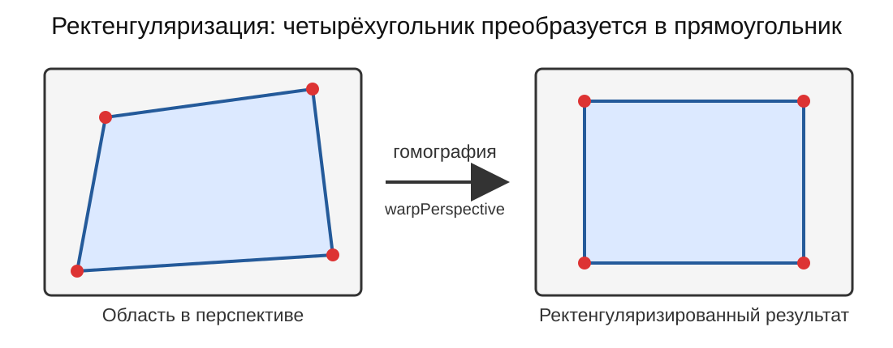
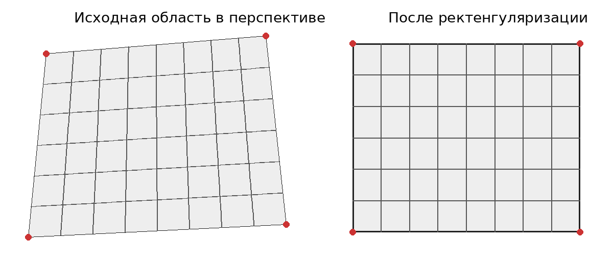

# Работа с ректенгуляризированным изображением в ROS 2

---

## Цель урока

Преобразовать выбранную плоскую четырехугольную область изображения в прямоугольник и опубликовать результат в отдельный ROS 2-топик.




---

## Что означает ректенгуляризация

**Ректенгуляризация** (`image rectangularization`) сопоставляет четыре угла плоского объекта с углами выходного прямоугольника.


Так можно обработать лист бумаги, экран, табличку, панель прибора или участок пола, снятые под углом. Калибровка исправляет оптические искажения камеры, а ректенгуляризация изменяет перспективный вид выбранной области.




---

## Основной алгоритм

Для построения преобразования OpenCV использует четыре исходные точки и четыре угла выходного прямоугольника.

Ключевые операции:

```python
matrix = cv2.getPerspectiveTransform(source_points, destination_points)
result = cv2.warpPerspective(image, matrix, (output_width, output_height))
```

Исходные точки необходимо задавать в следующем порядке:

```text
верхняя левая -> верхняя правая -> нижняя правая -> нижняя левая
```

Если изменить порядок, результат может оказаться повернутым, зеркально отраженным или сильно искаженным.

---

## Готовый ROS 2-пакет

Исходный код ноды уже находится в каталоге:

```text
ros2_ws/src/camera_rectangularizer
```


В статье рассматриваются назначение пакета, настройка параметров, сборка и запуск.

Нода выполняет следующую последовательность:

1. подписывается на `/camera/image_raw` и `/camera/camera_info`
2. при наличии параметров камеры исправляет оптические искажения
3. преобразует выбранную четырехугольную область в прямоугольник
4. публикует результат в `/camera/image_rectangularized`

---

## Установка зависимостей и сборка

Перейдите в рабочее пространство и установите зависимости:

```bash
sudo apt install ros-$ROS_DISTRO-cv-bridge python3-opencv

cd ros2_ws
source /opt/ros/$ROS_DISTRO/setup.bash
rosdep install -i --from-path src --rosdistro $ROS_DISTRO -y
colcon build --symlink-install
source install/setup.bash
```


После изменения исходного кода пакет необходимо собрать заново. Изменение YAML-файла обычно требует только перезапуска ноды.

---

## Подготовка камеры

Сначала выполните урок по калибровке камеры.

Запустите камеру тем же драйвером, в том же разрешении и с теми же настройками, которые использовались при калибровке. Драйвер должен публиковать изображение и параметры камеры.

Проверьте наличие данных:

```bash
ros2 topic hz /camera/image_raw
ros2 topic echo /camera/camera_info --once
```

В массиве `k` сообщения `/camera/camera_info` должны находиться ненулевые значения. Если параметры камеры не получены, нода продолжит работать, но оптические искажения исправлены не будут.

---

## Выбор четырех исходных точек

Необходимо определить координаты четырех углов плоского объекта в пикселях.


Точки выбираются на изображении после исправления оптических искажений, потому что именно к такому кадру нода применяет перспективное преобразование.


Для выбора точек можно использовать небольшой вспомогательный OpenCV-скрипт или графический редактор, отображающий координаты курсора. Изображение должно быть открыто в исходном разрешении без изменения масштаба.


Ключевая часть обработчика щелчков мыши может выглядеть так:

```python
points = []

def on_click(event, x, y, flags, data):
    if event == cv2.EVENT_LBUTTONDOWN and len(points) < 4:
        points.append((x, y))
        print(f"{len(points)}: ({x}, {y})")

cv2.setMouseCallback("select_points", on_click)
```

---

Перед отображением кадра следует применить параметры камеры:

```python
corrected = cv2.undistort(frame, camera_matrix, distortion_coefficients)
```

---

Выберите точки в порядке:

```text
1. верхняя левая
2. верхняя правая
3. нижняя правая
4. нижняя левая
```

---

Для четырех точек параметр `source_points` должен содержать восемь чисел:

```text
[x1, y1, x2, y2, x3, y3, x4, y4]
```

---

## Настройка параметров

Откройте файл:

```text
ros2_ws/src/camera_rectangularizer/config/rectangularization.yaml
```


Пример настройки для входного изображения `640 x 400`:

```yaml
camera_rectangularizer:
  ros__parameters:
    input_image_topic: /camera/image_raw
    camera_info_topic: /camera/camera_info
    source_points: [120.0, 60.0, 520.0, 80.0, 560.0, 350.0, 80.0, 330.0]
    output_width: 640
    output_height: 400
```

---

Для изображения `640 x 400` каждая точка должна удовлетворять условиям:

```text
0 <= x < 640
0 <= y < 400
```

Параметры `output_width` и `output_height` задают размер выходного изображения.

Чтобы объект не выглядел растянутым, отношение сторон результата должно примерно соответствовать отношению сторон реального объекта:

```text
output_width / output_height ~= ширина объекта / высота объекта
```

Если положение камеры или объекта изменилось, координаты `source_points` необходимо определить заново.

---

## Запуск

Оставьте драйвер камеры работающим.

В новом терминале выполните:

```bash
cd ros2_ws
source /opt/ros/$ROS_DISTRO/setup.bash
source install/setup.bash
ros2 launch camera_rectangularizer rectangularization.launch.py
```

Нода должна начать публиковать результат в топик:

```text
/camera/image_rectangularized
```

---

## Просмотр результата

Откройте изображение:

```bash
ros2 run rqt_image_view rqt_image_view
```

В списке топиков выберите:

```text
/camera/image_rectangularized
```

---

## Проверка работы

Проверьте ноду и выходной топик:

```bash
ros2 node list | grep rectangularizer
ros2 topic hz /camera/image_rectangularized
ros2 topic info /camera/image_rectangularized
```

---

При правильной настройке:

- выбранная область занимает выходной кадр
- противоположные стороны выглядят параллельными
- углы близки к `90` градусам
- прямые линии не имеют заметного изгиба
- пропорции объекта выглядят естественно

Если изображение повернуто или отражено, проверьте порядок исходных точек.

Если объект растянут, измените `output_width` и `output_height`.


Если линии остаются заметно изогнутыми, проверьте содержимое `/camera/camera_info` и соответствие разрешения параметрам калибровки.

---

## Итог

После выполнения урока выбранная плоская область преобразуется в прямоугольный вид и публикуется в `/camera/image_rectangularized`.

---

## Внешние источники

- [OpenCV: getPerspectiveTransform и warpPerspective](https://docs.opencv.org/4.x/da/d54/group__imgproc__transform.html)
- [cv_bridge](https://docs.ros.org/en/jazzy/p/cv_bridge/)
- [sensor_msgs/CameraInfo](https://docs.ros.org/en/jazzy/p/sensor_msgs/interfaces/msg/CameraInfo.html)
