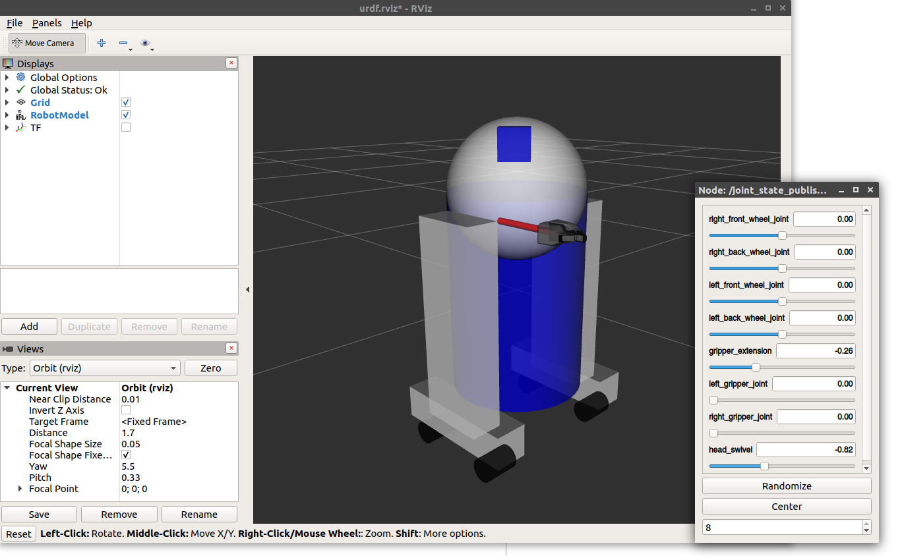

# **Туториал по ROS 2: Создаём подвижную модель робота в URDF**
*Учимся добавлять в URDF суставы с разными типами движения*

## 🎯 **Цель туториала**
Научиться описывать в URDF не просто статичные детали, а **подвижные соединения (joints)**. Мы добавим в модель R2D2 три типа суставов: **непрерывный (continuous)**, **вращательный с ограничениями (revolute)** и **поступательный (prismatic)**. После этого мы сможем управлять движением модели через графический интерфейс.

---

## 📖 **Зачем нужны подвижные суставы?**
В предыдущем туториале (по созданию статической модели) все соединения были типа `fixed` — детали жёстко прикреплены друг к другу. Но настоящие роботы двигаются:
*   Колёса должны **вращаться** (непрерывно).
*   Схваты должны **открываться и закрываться** (вращаться, но с ограничениями).
*   Выдвижные манипуляторы должны **вдвигаться и выдвигаться** (поступательное движение).

URDF позволяет описать всё это с помощью разных типов суставов (`joint`), а специальные инструменты (GUI и `robot_state_publisher`) помогут нам это увидеть и протестировать.

---

## ✅ **Предварительные требования**
1.  Установлены все пакеты из предыдущего туториала "[Building a visual robot model](https://github.com/ros/urdf_tutorial/tree/ros2/)" (пакет `urdf_tutorial`).
2.  Базовое понимание структуры URDF (линки, джойнты).
3.  Установлен `rviz2` и `joint_state_publisher_gui` (обычно идут в комплекте).

---

## 🚀 **Практическая часть: Оживляем R2D2**

### **1. Запуск готовой подвижной модели**
Установка пакета `urdf_tutorial`

```bash
cd ~/ros2_ws
sudo apt install ros-jazzy-urdf-launch
colcon build
source ~/ros2_ws/install/setup.bash
```
Для начала посмотрим, что мы будем создавать. В пакете `urdf_tutorial` есть готовый файл с подвижными суставами.


Выполните команду:
```bash
ros2 launch urdf_tutorial display.launch.py model:=urdf/06-flexible.urdf
```
Откроется окно **rviz2** с моделью R2D2. Но теперь, кроме этого, появится ещё и окно с ползунками (**GUI**).



Попробуйте подвигать ползунки. Вы увидите, как:
*   Вращается голова робота (вокруг вертикальной оси).
*   Сдвигается и раздвигается захват.
*   Выдвигается и втягивается "рука" с захватом.

Как это работает? Давайте разберём код URDF, который отвечает за это волшебство.

### **2. Анализ кода URDF**

#### **2.1 Голова: непрерывное вращение (Continuous Joint)**
```xml
<joint name="head_swivel" type="continuous">
  <parent link="base_link"/>
  <child link="head"/>
  <axis xyz="0 0 1"/>
  <origin xyz="0 0 0.3"/>
</joint>
```
*   **`type="continuous"`** — это означает, что сустав может вращаться бесконечно в любую сторону (как колесо). Нет верхних и нижних границ.
*   **`<axis xyz="0 0 1"/>`** — определяет **ось вращения**. Вектор `(0,0,1)` означает, что вращение происходит вокруг оси Z. Если бы мы хотели, чтобы голова кивала (вперёд-назад), ось была бы `(1,0,0)` или `(0,1,0)`.
*   **`<origin .../>`** — задаёт положение сустава относительно родительского линка. Здесь голова находится на 0.3 метра выше основания (`base_link`).

#### **2.2 Захват: вращение с ограничениями (Revolute Joint)**
```xml
<joint name="left_gripper_joint" type="revolute">
  <axis xyz="0 0 1"/>
  <limit effort="1000.0" lower="0.0" upper="0.548" velocity="0.5"/>
  <origin rpy="0 0 0" xyz="0.2 0.01 0"/>
  <parent link="gripper_pole"/>
  <child link="left_gripper"/>
</joint>
```
*   **`type="revolute"`** — похож на `continuous`, но имеет **ограничения**. Используется для суставов, которые не могут вращаться бесконечно (например, локоть человека, схват робота).
*   **`<limit .../>`** — обязательный тег для `revolute`. Здесь:
    *   `lower="0.0"` и `upper="0.548"` — минимальный и максимальный угол поворота **в радианах** (от 0 до ~31 градуса).
    *   `effort` и `velocity` — максимальные усилие и скорость (важно для симуляции физики, но для визуализации значения не критичны).
*   Обратите внимание, что у правого и левого схвата могут быть свои оси и ограничения.

#### **2.3 Выдвижная рука: поступательное движение (Prismatic Joint)**
```xml
<joint name="gripper_extension" type="prismatic">
  <parent link="base_link"/>
  <child link="gripper_pole"/>
  <axis xyz="1 0 0"/>
  <limit effort="1000.0" lower="-0.38" upper="0" velocity="0.5"/>
  <origin rpy="0 0 0" xyz="0.19 0 0.2"/>
</joint>
```
*   **`type="prismatic"`** — это **поступательное** движение (линейное). Деталь не вращается, а скользит вдоль оси.
*   **`<axis xyz="1 0 0"/>`** — ось движения: здесь это ось X. Деталь будет двигаться вперёд и назад.
*   **`<limit .../>`** — здесь `lower` и `upper` задаются **в метрах**, а не в радианах. `lower="-0.38"` и `upper="0"` означают, что рука может втягиваться на 0.38 м назад (отрицательное направление X) и выдвигаться до нулевой позиции.

### **3. Другие типы суставов**
В URDF есть ещё два типа подвижных соединений, которые не описываются простым числом (одной переменной):
*   **`planar`** — движение в плоскости (по двум осям, например, стол на воздушной подушке).
*   **`floating`** — свободное движение в пространстве (6 степеней свободы). Используется для описания положения самого робота в мире.

Эти типы сложнее и в этом туториале не рассматриваются.

### **4. Как это всё работает?**
1.  **GUI (`joint_state_publisher_gui`)** читает URDF-файл, находит все нефиксированные суставы (`continuous`, `revolute`, `prismatic`) и их пределы. Для каждого такого сустава он создаёт ползунок.
2.  Когда вы двигаете ползунок, GUI публикует сообщение типа **`sensor_msgs/msg/JointState`** в топик `/joint_states`. Это сообщение содержит имена суставов и их текущие положения (в радианах или метрах).
3.  Узел **`robot_state_publisher`** подписан на `/joint_states`. Он знает URDF-модель и, получая положения суставов, вычисляет, где в пространстве должен находиться каждый линк.
4.  Результат этих вычислений — дерево трансформаций **tf2**, которое и используется `rviz2` для отображения модели в движении.

---

## 📝 **Ключевые выводы**
✅ **`continuous`** — для бесконечного вращения (колёса, шарниры без упоров).
✅ **`revolute`** — для вращения с ограничениями (схваты, локти, колени). Обязателен тег `<limit>`.
✅ **`prismatic`** — для линейного движения (выдвижные части, поршни). Единицы измерения — метры.
✅ **Ось движения** задаётся вектором `<axis xyz="...">`.
✅ `joint_state_publisher_gui` + `robot_state_publisher` превращают статическую модель в интерактивную, публикуя трансформации в tf2.

---

## 🎮 **Практическое задание**
1.  Найдите на своём компьютере файл `06-flexible.urdf` (он находится в пакете `urdf_tutorial`). Откройте его и изучите полную структуру.
2.  Измените параметры:
    *   Сделайте так, чтобы голова вращалась вокруг оси Y (кивала), а не вокруг Z.
    *   Увеличьте предел открытия захвата (`upper` для `left_gripper_joint`) до 1.0 радиана.
    *   Измените диапазон движения выдвижной руки, чтобы она выдвигалась не до 0, а до +0.2 метра.
3.  Сохраните изменения в новом URDF-файле и запустите его через `display.launch.py`, чтобы увидеть результат.

---

## 🔜 **Что дальше?**
Теперь вы умеете создавать подвижные модели. Следующим шагом может быть:
*   Добавление **физических свойств** (масса, инерция, материалы) для симуляции в Gazebo.
*   Использование **Xacro** для упрощения и параметризации URDF-кода.
*   Создание собственной модели робота с нуля.
