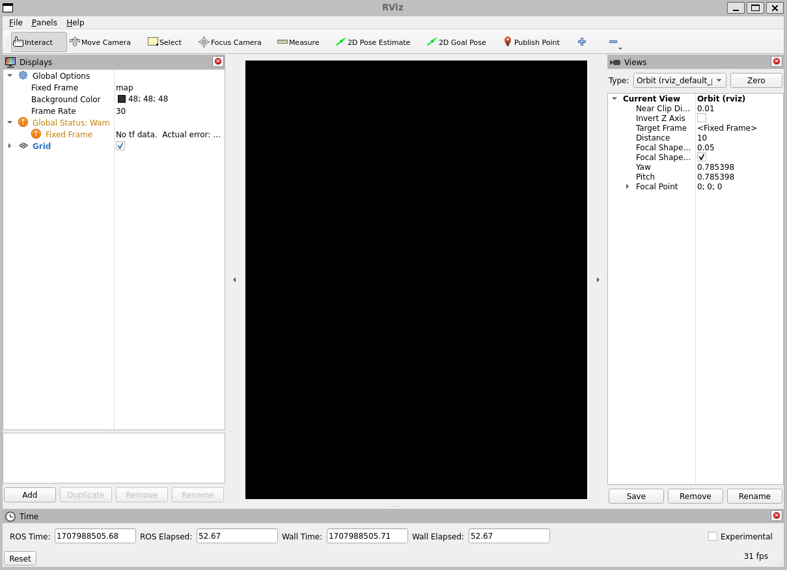
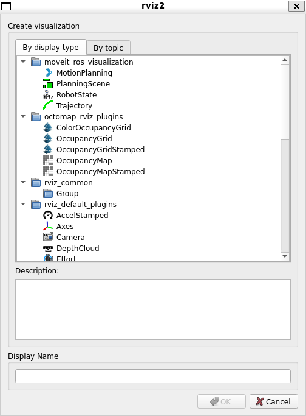
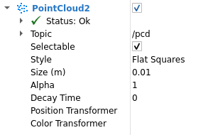
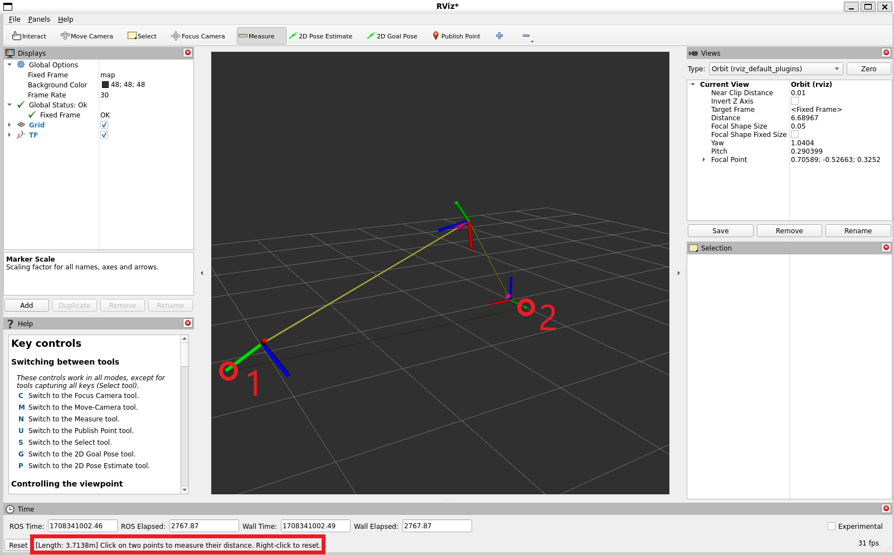

# Руководство пользователя RViz

**Цель:** Понять, что такое RViz.  

---

## Введение

RViz — это 3D-визуализатор для фреймворка Robot Operating System (ROS).

## Установка или сборка rviz

Следуйте инструкциям по установке для вашей операционной системы, чтобы установить RViz.

## Запуск

Не забудьте выполнить source файла настроек:

```bash
source /opt/ros/jazzy/setup.bash
```

Затем запустите визуализатор:

```bash
ros2 run rviz2 rviz2
```

При первом запуске RViz вы увидите это окно:



Большое черное окно в центре — это 3D-вид (сейчас он пуст, потому что нечему отображаться). Слева находится список дисплеев (Displays), в котором будут показаны все загруженные дисплеи. Сейчас там только глобальные настройки и сетка (Grid), о которой мы поговорим позже. Справа находятся другие панели, описанные ниже.

## Дисплеи (Displays)

Дисплей — это то, что отображает что-то в 3D-мире и, вероятно, имеет некоторые настройки в списке дисплеев. Примером может служить облако точек, состояние робота и т.д.

### Добавление нового дисплея

Чтобы добавить дисплей, нажмите кнопку **Add** внизу:


Откроется диалог добавления нового дисплея:



Список вверху содержит тип дисплея. Тип определяет, какие данные будет визуализировать этот дисплей. Текстовое поле посередине дает описание выбранного типа дисплея. Наконец, вы должны задать уникальное имя дисплея. Если у вашего робота, например, два лазерных сканера, вы можете создать два дисплея `Laser Scan` с именами «Laser Base» и «Laser Head».

### Свойства дисплея (Display Properties)

Каждый дисплей имеет свой собственный список свойств. Например:



### Статус дисплея (Display Status)

Каждый дисплей имеет свой статус, чтобы вы знали, всё ли в порядке. Статус может быть: `OK`, `Warning`, `Error` или `Disabled`. Статус отображается в заголовке дисплея цветом фона, а также в категории **Status**, которую вы можете увидеть, если развернуть дисплей:


Категория **Status** также раскрывается, показывая конкретную информацию о статусе. Эта информация различается для разных дисплеев, и сообщения должны быть понятны.

### Встроенные типы дисплеев

| Имя | Описание | Используемые сообщения |
| :--- | :--- | :--- |
| **Axes** | Отображает набор осей | |
| **Effort** | Показывает усилие, прилагаемое к каждому вращательному шарниру робота | `sensor_msgs/msg/JointStates` |
| **Camera** | Создает новое окно визуализации с точки зрения камеры и накладывает изображение поверх него | `sensor_msgs/msg/Image`, `sensor_msgs/msg/CameraInfo` |
| **Grid** | Отображает 2D или 3D сетку вдоль плоскости | |
| **Grid Cells** | Рисует ячейки из сетки, обычно препятствия из карты стоимостей (costmap) от навигационного стека | `nav_msgs/msg/GridCells` |
| **Image** | Создает новое окно визуализации с изображением. В отличие от дисплея Camera, этот дисплей не использует CameraInfo | `sensor_msgs/msg/Image` |
| **InteractiveMarker** | Отображает 3D-объекты от одного или нескольких серверов интерактивных маркеров и позволяет взаимодействовать с ними мышью | `visualization_msgs/msg/InteractiveMarker` |
| **Laser Scan** | Показывает данные лазерного сканирования с различными вариантами режимов рендеринга, накопления и т.д. | `sensor_msgs/msg/LaserScan` |
| **Map** | Отображает карту на наземной плоскости | `nav_msgs/msg/OccupancyGrid` |
| **Markers** | Позволяет программистам отображать произвольные примитивные формы через тему | `visualization_msgs/msg/Marker`, `visualization_msgs/msg/MarkerArray` |
| **Path** | Показывает путь от навигационного стека | `nav_msgs/msg/Path` |
| **Point** | Рисует точку в виде маленькой сферы | `geometry_msgs/msg/PointStamped` |
| **Pose** | Рисует позу в виде стрелки или осей | `geometry_msgs/msg/PoseStamped` |
| **Pose Array** | Рисует «облако» стрелок по одной для каждой позы в массиве поз | `geometry_msgs/msg/PoseArray` |
| **Point Cloud(2)** | Показывает данные облака точек с различными вариантами режимов рендеринга, накопления и т.д. | `sensor_msgs/msg/PointCloud`, `sensor_msgs/msg/PointCloud2` |
| **Polygon** | Рисует контур полигона в виде линий | `geometry_msgs/msg/Polygon` |
| **Odometry** | Накопляет позы одометрии с течением времени | `nav_msgs/msg/Odometry` |
| **Range** | Отображает конусы, представляющие измерения дальности от ультразвуковых или ИК-датчиков дальности | `sensor_msgs/msg/Range` |
| **RobotModel** | Показывает визуальное представление робота в правильной позе (определяемой текущими преобразованиями TF) | |
| **TF** | Отображает иерархию преобразований tf2 | |
| **Wrench** | Рисует wrench (сила/момент) в виде стрелки (сила) и стрелки с кругом (момент) | `geometry_msgs/msg/WrenchStamped` |
| **Twist** | Рисует twist (линейная/угловая скорость) в виде стрелки (линейная) и стрелки с кругом (угловая) | `geometry_msgs/msg/TwistStamped` |

## Конфигурации

Разные конфигурации дисплеев часто полезны для разных целей использования визуализатора. Конфигурация, полезная для полного робота PR2, не обязательно полезна, например, для тестовой тележки. Для этого визуализатор позволяет загружать и сохранять различные конфигурации.

Конфигурация содержит:
- Дисплеи + их свойства
- Свойства инструментов
- Точку обзора и настройки для 3D-визуализации

## Панель видов (Views Panel)

В визуализаторе доступно несколько различных типов камер.


Типы камер включают как различные способы управления камерой, так и разные типы проекции (ортографическая или перспективная).

### Орбитальная камера (Orbital Camera, по умолчанию)

Орбитальная камера просто вращается вокруг фокальной точки, всегда глядя на неё. Фокальная точка визуализируется в виде маленького диска, когда вы перемещаете камеру:


**Управление:**
- **Левая кнопка мыши:** Нажмите и перетащите, чтобы вращаться вокруг фокальной точки.
- **Средняя кнопка мыши:** Нажмите и перетащите, чтобы перемещать фокальную точку в плоскости, образованной векторами «вверх» и «вправо» камеры. Расстояние перемещения зависит от фокальной точки — если на фокальной точке есть объект, и вы щелкните по нему, он останется под вашей мышью.
- **Правая кнопка мыши:** Нажмите и перетащите, чтобы приблизить/отдалить фокальную точку. Перетаскивание вверх приближает, вниз — отдаляет.
- **Колесико мыши:** Приблизить/отдалить фокальную точку.

### Камера FPS (first-person, от первого лица)

Камера FPS — это камера от первого лица, она вращается так, как если бы вы смотрели своей головой.

**Управление:**
- **Левая кнопка мыши:** Нажмите и перетащите, чтобы вращаться. Control+щелчок, чтобы выбрать объект под мышью и посмотреть прямо на него.
- **Средняя кнопка мыши:** Нажмите и перетащите, чтобы перемещаться по плоскости, образованной векторами «вверх» и «вправо» камеры.
- **Правая кнопка мыши:** Нажмите и перетащите, чтобы перемещаться вдоль вектора направления камеры. Перетаскивание вверх движет вперед, вниз — назад.
- **Колесико мыши:** Движение вперед/назад.

### Ортографическая вид сверху (Top-down Orthographic)

Ортографическая камера «вид сверху» всегда смотрит вниз вдоль оси Z (в системе координат робота) и является ортографическим видом, что означает, что объекты не становятся меньше по мере удаления.

**Управление:**
- **Левая кнопка мыши:** Нажмите и перетащите, чтобы вращаться вокруг оси Z.
- **Средняя кнопка мыши:** Нажмите и перетащите, чтобы перемещать камеру вдоль плоскости XY.
- **Правая кнопка мыши:** Нажмите и перетащите, чтобы масштабировать изображение.
- **Колесико мыши:** Масштабировать изображение.

### XY Orbit (Орбитальная XY)

То же, что и орбитальная камера, но точка фокуса ограничена плоскостью XY.

**Управление:** См. орбитальную камеру.

### Third Person Follower (Следование от третьего лица)

Камера сохраняет постоянный угол обзора по отношению к целевому фрейму. В отличие от XY Orbit, камера поворачивается, если целевой фрейм меняет рыскание (yaw). Это может быть удобно, если вы, например, занимаетесь 3D-картографированием коридора с поворотами.

**Управление:** См. орбитальную камеру.

### Пользовательские виды (Custom Views)

Панель видов также позволяет создавать различные именованные виды, которые сохраняются и между которыми можно переключаться. Вид состоит из целевого фрейма, типа камеры и позы камеры. Вы можете сохранить вид, нажав кнопку **Save** на панели видов.


Вид состоит из:
- Типа контроллера вида
- Конфигурации вида (положение, ориентация и т.д.; возможно, разная для каждого типа контроллера)
- Целевого фрейма (Target Frame)

Виды сохраняются для каждого пользователя, а не в файлах конфигурации.

## Системы координат (Coordinate Frames)

RViz использует систему преобразований tf для трансформации данных из системы координат, в которой они приходят, в глобальную систему отсчета. В визуализаторе есть две важные системы координат: целевой фрейм (target frame) и фиксированный фрейм (fixed frame).

### Фиксированный фрейм (Fixed Frame)

Более важный из двух фреймов — это фиксированный фрейм. Фиксированный фрейм — это система отсчета, используемая для обозначения «мирового» фрейма. Обычно это `map`, `world` или что-то подобное, но также может быть, например, ваш фрейм одометрии.

Если фиксированный фрейм ошибочно установлен, скажем, на базовую систему координат робота (`base_link`), то все объекты, которые робот когда-либо видел, будут появляться перед роботом в том положении относительно робота, в котором они были обнаружены. Для корректных результатов фиксированный фрейм не должен двигаться относительно мира.

Если вы измените фиксированный фрейм, все отображаемые в данный момент данные будут очищены, а не перепреобразованы.

### Целевой фрейм (Target Frame)

Целевой фрейм — это система отсчета для обзора камеры. Например, если ваш целевой фрейм — это `map`, вы будете видеть, как робот движется по карте. Если целевой фрейм — это база робота (`base_link`), то робот будет оставаться на месте, а всё остальное будет двигаться относительно него.

## Инструменты (Tools)

Визуализатор имеет ряд инструментов, доступных на панели инструментов. В следующих разделах дается краткое введение в эти инструменты. Дополнительную информацию можно найти в **Help -> Show Help panel**.


### Interact (Взаимодействие)

Этот инструмент позволяет взаимодействовать с визуализированной средой. Вы можете щелкать по объектам и, в зависимости от их свойств, просто выбирать их, перемещать и многое другое.

**Сочетание клавиш:** `i`

### Move Camera (Перемещение камеры)

Инструмент **Move Camera** является инструментом по умолчанию. Когда он выбран и вы щелкаете внутри 3D-вида, точка обзора изменяется в соответствии с опциями и типом камеры, выбранными на панели **Views**. Смотрите предыдущий раздел **Views Panel** для получения дополнительной информации.

**Сочетание клавиш:** `m`

### Select (Выбор)

Инструмент **Select** позволяет выбирать элементы, отображаемые в 3D-виде. Он поддерживает выбор одной точкой, а также выбор прямоугольной областью с помощью перетаскивания. Вы можете добавить к выделению, удерживая клавишу **Shift**, и удалить из выделения, удерживая клавишу **Ctrl**. Если вы хотите перемещать камеру во время выбора, не переключаясь обратно на инструмент **Move Camera**, вы можете удерживать клавишу **Alt**. Клавиша **f** сфокусирует камеру на текущем выделении.

 

**Сочетание клавиш:** `s`

### Focus Camera (Фокус камеры)

**Focus Camera** позволяет выбрать местоположение в визуализаторе. Камера затем сфокусируется на этой точке, изменив свою ориентацию, но не положение.

**Сочетание клавиш:** `c`

### Measure (Измерение)

С помощью инструмента **Measure** вы можете измерить расстояние между двумя точками в визуализаторе. Первый щелчок после активации инструмента установит начальную точку, а второй — конечную точку измерения. Полученное расстояние будет отображаться внизу окна RViz. Но обратите внимание, что инструмент измерения работает только с фактически отображаемыми объектами в визуализаторе, вы не можете использовать его в пустом пространстве.



**Сочетание клавиш:** `n`

### 2D Pose Estimate (Оценка 2D-позы)

Этот инструмент позволяет установить начальную позу для инициализации системы локализации (отправляется в топик ROS `initialpose`). Щелкните по местоположению на наземной плоскости и перетащите, чтобы выбрать ориентацию. Выходной топик можно изменить на панели **Tool Properties**.


Этот инструмент работает с навигационным стеком.

**Сочетание клавиш:** `p`

### 2D Nav Goal (2D-цель навигации)

Этот инструмент позволяет установить цель, отправляемую в топик ROS `goal_pose`. Щелкните по местоположению на наземной плоскости и перетащите, чтобы выбрать ориентацию. Выходной топик можно изменить на панели **Tool Properties**.

Этот инструмент работает с навигационным стеком.

**Сочетание клавиш:** `g`

### Publish Point (Опубликовать точку)

Инструмент **Publish Point** позволяет выбрать объект в визуализаторе, и инструмент опубликует координаты этой точки относительно фрейма. Результаты отображаются внизу, как и в инструменте **Measure**, но также публикуются в тему `clicked_point`.

**Сочетание клавиш:** `u`

## Время (Time)

Панель **Time** в основном полезна при работе с симулятором, так как позволяет видеть, сколько времени ROS прошло по сравнению со временем настенных часов (Wall Clock). Панель времени также позволяет сбросить внутреннее состояние времени визуализатора, что приводит к сбросу всех дисплеев, а также внутреннего кэша данных tf.


Если вы не работаете с симуляцией, панель времени в основном бесполезна. В большинстве случаев её можно закрыть, и вы, вероятно, даже не заметите этого (кроме того, что у вас станет немного больше места на экране для остальной части rviz).
