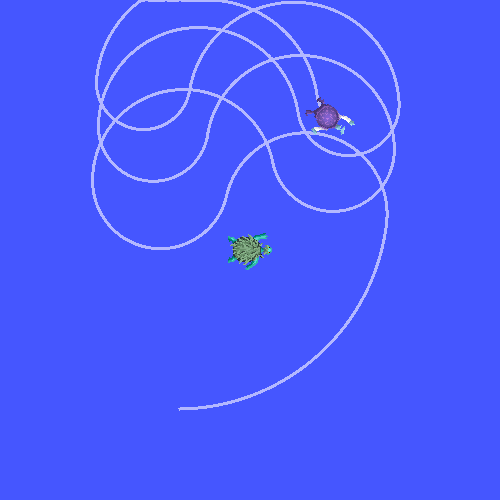

# **Туториал по ROS 2: Добавляем новый фрейм в tf2 (Python)**
*Учимся расширять дерево трансформаций, добавляя статические и движущиеся фреймы*

## 🎯 **Цель туториала**
Научиться добавлять в дерево tf2 дополнительные координатные фреймы. Мы создадим новый фрейм `carrot1` как дочерний для черепахи `turtle1` и научим вторую черепаху следовать за этой «морковкой», а не за самой черепахой. Также мы сделаем динамический вариант, где `carrot1` движется по окружности.

## 📖 **Зачем добавлять новые фреймы?**
В реальных робототехнических задачах очень удобно мыслить в локальных системах координат. Например:
*   Данные лазерного сканера проще интерпретировать в системе координат, привязанной к самому сканеру.
*   Схватить объект проще, если мы знаем его положение относительно **схвата манипулятора**.

Каждый новый фрейм (например, `laser_frame`, `gripper_frame`) должен быть чьим-то **дочерним** фреймом. tf2 строит **древовидную структуру** (иерархию), где у каждого фрейма может быть только один родитель, но сколько угодно детей. Это гарантирует однозначность преобразований.


*Текущее дерево: world — родитель для turtle1 и turtle2*

---

## ✅ **Предварительные требования**
1. **Полностью выполнены все предыдущие туториалы по tf2:**
    *   "[Знакомство с tf2](link_to_intro)"
    *   "[Пишем статический broadcaster (Python)](link_to_static)"
    *   "[Пишем динамический broadcaster (Python)](link_to_dynamic)"
    *   "[Пишем listener (Python)](link_to_listener)"
2. Наличие пакета `learning_tf2_py` со всеми узлами и launch-файлами.
3. Рабочее окружение ROS 2.

---

## 🚀 **Практическая часть: Добавляем фрейм "carrot1"**

### **1. Фиксированный фрейм (статическая "морковка")**

Мы создадим новый фрейм `carrot1`, который будет всегда находиться на 2 метра выше (по оси Y) относительно `turtle1`. Это будет **фиксированное** смещение, не меняющееся во времени.

#### **1.1 Создание узла fixed_frame_broadcaster**
Перейдите в директорию пакета и загрузите пример кода:

```bash
cd ~/ros2_ws/src/learning_tf2_py/learning_tf2_py
wget https://raw.githubusercontent.com/ros/geometry_tutorials/jazzy/turtle_tf2_py/turtle_tf2_py/fixed_frame_tf2_broadcaster.py
```

Теперь откройте файл `fixed_frame_tf2_broadcaster.py` в текстовом редакторе.

```python
from geometry_msgs.msg import TransformStamped
import rclpy
from rclpy.node import Node
from tf2_ros import TransformBroadcaster

class FixedFrameBroadcaster(Node):

    def __init__(self):
        super().__init__('fixed_frame_tf2_broadcaster')
        self.tf_broadcaster = TransformBroadcaster(self)
        self.timer = self.create_timer(0.1, self.broadcast_timer_callback)

    def broadcast_timer_callback(self):
        t = TransformStamped()

        t.header.stamp = self.get_clock().now().to_msg()
        t.header.frame_id = 'turtle1'          # Родительский фрейм
        t.child_frame_id = 'carrot1'           # Новый дочерний фрейм

        # Смещение: на 2 метра по Y в системе координат turtle1
        t.transform.translation.x = 0.0
        t.transform.translation.y = 2.0
        t.transform.translation.z = 0.0

        # Поворота нет (кватернион единичный)
        t.transform.rotation.x = 0.0
        t.transform.rotation.y = 0.0
        t.transform.rotation.z = 0.0
        t.transform.rotation.w = 1.0

        self.tf_broadcaster.sendTransform(t)

def main():
    rclpy.init()
    node = FixedFrameBroadcaster()
    try:
        rclpy.spin(node)
    except KeyboardInterrupt:
        pass
    rclpy.shutdown()
```

#### **1.2 Разбор кода**
*   Мы используем обычный **`TransformBroadcaster`** (не статический), потому что хотим публиковать трансформацию с частотой 10 Гц (таймер 0.1 с). Хотя данные не меняются, постоянная публикация гарантирует, что они всегда доступны в буфере tf2.
*   Важно: родительский фрейм — **`turtle1`**, дочерний — **`carrot1`**.
*   Трансляция задаёт смещение по `y` на 2 метра и нулевой поворот.

#### **1.3 Добавление точки входа**
Откройте `~/ros2_ws/src/learning_tf2_py/setup.py` и добавьте новую скрипту в `console_scripts`:

```python
    'console_scripts': [
        # ... другие записи ...
        'fixed_frame_tf2_broadcaster = learning_tf2_py.fixed_frame_tf2_broadcaster:main',
    ],
```

#### **1.4 Создание launch-файла**
Чтобы запустить всё вместе, создадим новый launch-файл, который будет включать предыдущий демонстрационный launch (с двумя черепахами и listener'ом) и наш новый broadcaster.

Создайте файл `turtle_tf2_fixed_frame_demo.launch.py` в папке `launch`:

```python
from launch import LaunchDescription
from launch.actions import IncludeLaunchDescription
from launch.substitutions import PathJoinSubstitution
from launch_ros.actions import Node
from launch_ros.substitutions import FindPackageShare

def generate_launch_description():
    return LaunchDescription([
        # Включаем базовый launch с двумя черепахами и listener'ом
        IncludeLaunchDescription(
            PathJoinSubstitution([
                FindPackageShare('learning_tf2_py'),
                'launch',
                'turtle_tf2_demo.launch.py'
            ])
        ),
        # Добавляем наш fixed broadcaster
        Node(
            package='learning_tf2_py',
            executable='fixed_frame_tf2_broadcaster',
            name='fixed_broadcaster',
        ),
    ])
```

#### **1.5 Сборка и запуск**
Соберите пакет:

```bash
cd ~/ros2_ws
colcon build --packages-select learning_tf2_py
source install/setup.bash
```

Запустите демонстрацию:

```bash
ros2 launch learning_tf2_py turtle_tf2_fixed_frame_demo.launch.py
```

Откроется окно `turtlesim` с двумя черепахами. Управляйте первой черепахой (в отдельном терминале `ros2 run turtlesim turtle_teleop_key`).

#### **1.6 Проверка нового фрейма**
В новом терминале выполните команду, чтобы увидеть дерево фреймов:

```bash
ros2 run tf2_tools view_frames
```

Откройте сгенерированный файл `frames.pdf`. Вы должны увидеть, что у фрейма `turtle1` появился дочерний фрейм **`carrot1`**.


Обратите внимание: вторая черепаха по-прежнему следует за `turtle1`, потому что наш listener настроен на `target_frame:=turtle1`.

#### **1.7 Меняем цель на carrot1**
Чтобы вторая черепаха следовала за «морковкой», нужно изменить параметр `target_frame`. Это можно сделать прямо в командной строке при запуске:

```bash
ros2 launch learning_tf2_py turtle_tf2_fixed_frame_demo.launch.py target_frame:=carrot1
```

Теперь вторая черепаха будет стремиться не к самой первой черепахе, а к точке, которая находится на 2 метра выше неё (по оси Y). Попробуйте подвигать первую черепаху — вторая будет следовать за воображаемой морковкой!


---

### **2. Динамический фрейм (движущаяся "морковка")**

Фиксированная морковка — это скучно. Давайте заставим её двигаться относительно `turtle1` по кругу!

#### **2.1 Создание узла dynamic_frame_broadcaster**
Загрузите пример динамического broadcaster'а:

```bash
cd ~/ros2_ws/src/learning_tf2_py/learning_tf2_py
wget https://raw.githubusercontent.com/ros/geometry_tutorials/jazzy/turtle_tf2_py/turtle_tf2_py/dynamic_frame_tf2_broadcaster.py
```

Откройте файл `dynamic_frame_tf2_broadcaster.py`:

```python
import math
from geometry_msgs.msg import TransformStamped
import rclpy
from rclpy.node import Node
from tf2_ros import TransformBroadcaster

class DynamicFrameBroadcaster(Node):

    def __init__(self):
        super().__init__('dynamic_frame_tf2_broadcaster')
        self.tf_broadcaster = TransformBroadcaster(self)
        self.timer = self.create_timer(0.1, self.broadcast_timer_callback)

    def broadcast_timer_callback(self):
        seconds, _ = self.get_clock().now().seconds_nanoseconds()
        x = seconds * math.pi   # Угол, меняющийся со временем

        t = TransformStamped()
        t.header.stamp = self.get_clock().now().to_msg()
        t.header.frame_id = 'turtle1'
        t.child_frame_id = 'carrot1'

        # Смещение по окружности радиусом 10 метров
        t.transform.translation.x = 10 * math.sin(x)
        t.transform.translation.y = 10 * math.cos(x)
        t.transform.translation.z = 0.0

        t.transform.rotation.x = 0.0
        t.transform.rotation.y = 0.0
        t.transform.rotation.z = 0.0
        t.transform.rotation.w = 1.0

        self.tf_broadcaster.sendTransform(t)

def main():
    rclpy.init()
    node = DynamicFrameBroadcaster()
    try:
        rclpy.spin(node)
    except KeyboardInterrupt:
        pass
    rclpy.shutdown()
```

#### **2.2 Разбор кода**
*   В отличие от фиксированного варианта, координаты `x` и `y` вычисляются динамически с использованием текущего времени.
*   `seconds` — количество секунд с начала работы узла (с некоторой точностью).
*   Положение `carrot1` меняется по кругу: `x = 10*sin(π*t)`, `y = 10*cos(π*t)`. Таким образом, морковка будет описывать окружность радиусом 10 метров вокруг `turtle1`.

#### **2.3 Добавление точки входа**
В `setup.py` добавьте ещё одну запись:

```python
    'console_scripts': [
        # ...
        'dynamic_frame_tf2_broadcaster = learning_tf2_py.dynamic_frame_tf2_broadcaster:main',
    ],
```

#### **2.4 Создание launch-файла для динамики**
Создайте файл `turtle_tf2_dynamic_frame_demo.launch.py` в папке `launch`:

```python
from launch import LaunchDescription
from launch.actions import IncludeLaunchDescription
from launch.substitutions import PathJoinSubstitution
from launch_ros.actions import Node
from launch_ros.substitutions import FindPackageShare

def generate_launch_description():
    return LaunchDescription([
        # Включаем базовый launch, но сразу указываем target_frame:=carrot1
        IncludeLaunchDescription(
            PathJoinSubstitution([
                FindPackageShare('learning_tf2_py'),
                'launch',
                'turtle_tf2_demo.launch.py'
            ]),
            launch_arguments={'target_frame': 'carrot1'}.items()
        ),
        # Добавляем динамический broadcaster
        Node(
            package='learning_tf2_py',
            executable='dynamic_frame_tf2_broadcaster',
            name='dynamic_broadcaster',
        ),
    ])
```

#### **2.5 Сборка и запуск**
Соберите пакет снова (или просто выполните `colcon build` в корне workspace) и запустите:

```bash
ros2 launch learning_tf2_py turtle_tf2_dynamic_frame_demo.launch.py
```

Управляйте первой черепахой и наблюдайте за второй: она будет пытаться следовать за точкой, которая описывает круги вокруг первой черепахи!



---

## 📝 **Ключевые выводы**
✅ **tf2 строит древовидную структуру фреймов** — каждый фрейм (кроме корневого) имеет ровно одного родителя.
✅ Добавление нового фрейма ничем не отличается от публикации любой другой трансформации: нужен `TransformBroadcaster` и правильные `frame_id`.
✅ **Фиксированный фрейм** полезен для описания неизменных частей (датчиков, креплений).
✅ **Динамический фрейм** позволяет моделировать движущиеся части (качающийся манипулятор, вращающуюся голову).
✅ Изменяя параметр `target_frame` в listener'е, мы можем заставить робота преследовать не сам объект, а связанную с ним точку.

---

## 🎮 **Практическое задание**
1.  Создайте свой собственный фиксированный фрейм `laser_frame`, который будет смещён на 0.1 м по оси X и 0.2 м по оси Z относительно фрейма `turtle1`. Убедитесь, что он появился в дереве.
2.  Измените динамический фрейм так, чтобы он двигался не по кругу, а по эллипсу или совершал колебания вдоль одной оси.
3.  Попробуйте добавить фрейм, дочерний не для `turtle1`, а для `turtle2`. Понаблюдайте, как изменится дерево трансформаций.

---

## 🔜 **Что дальше?**
Теперь вы умеете создавать любые фреймы и управлять их движением. Следующим логичным шагом будет изучение более продвинутых возможностей tf2, таких как **использование времени** (запрос трансформаций в прошлом) и **обработка временных задержек**.