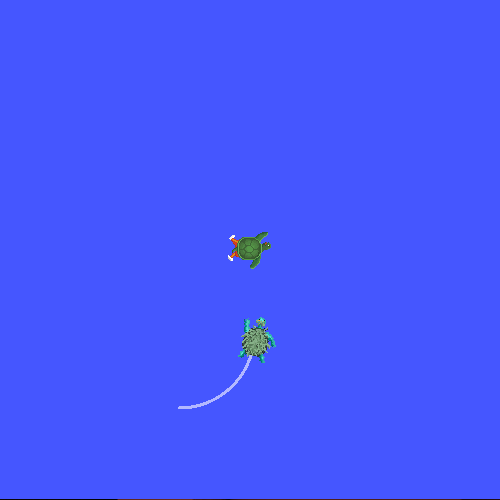

# Знакомство с tf2

## Цель туториала
Запустить демонстрацию с двумя черепахами в **turtlesim** и увидеть возможности библиотеки **tf2** в действии. Вы поймёте, как координатные фреймы (системы координат) помогают роботам понимать положение друг друга и окружающего мира.

---

## Что такое tf2?
**tf2** — это библиотека для ROS 2, которая занимается отслеживанием множества **координатных фреймов** (frames) во времени. Она позволяет в любой момент узнать:
* Где находится фрейм `A` относительно фрейма `B`?
* Какова была эта взаимосвязь в прошлом?

Вспомните концепцию **графа ROS** из предыдущего туториала. Если ноды выполняют работу, а топики передают сообщения, то **tf2** хранит карту координатных фреймов для всех частей робота.

### **Зачем это нужно?**
Любая задача робота связана с координатами:
* Датчик расстояния на базе сообщает: "Объект в 1 метре передо мной!"
* Но манипулятору нужно знать: "Где эта точка относительно **моей** системы координат, чтобы схватить объект?"
* Именно **tf2** автоматически выполняет это преобразование, используя связи между фреймами (например, `base_link` -> `laser_frame`).


---

## Практическая часть: демонстрация с двумя черепахами

### **1. Установка необходимых пакетов**
В отличие от простого `turtlesim`, нам понадобятся дополнительные инструменты для работы с tf2 и визуализации.

Откройте терминал и выполните команду для вашей системы:

**Ubuntu (apt):**
```bash
sudo apt-get install ros-jazzy-rviz2 ros-jazzy-turtle-tf2-py ros-jazzy-tf2-ros ros-jazzy-tf2-tools
```

> **Примечание:** Если вы используете другую версию ROS 2 (например, Humble или Iron), замените `jazzy` на название вашего дистрибутива.

### **2. Запуск демо с двумя черепахами**
Запустим готовую демонстрацию, которая создаст систему из нод, топиков и фреймов tf2.

В **первом терминале** выполните:
```bash
ros2 launch turtle_tf2_py turtle_tf2_demo.launch.py
```
Вы увидите окно **turtlesim** с двумя черепахами. Первая черепаха (с именем `turtle1`) будет просто стоять.



Чтобы управлять ей, откройте **второй терминал** и запустите ноду телеоперации:
```bash
ros2 run turtlesim turtle_teleop_key
```
Переключитесь на второй терминал и нажимайте стрелки на клавиатуре. Вторая черепаха (`turtle2`) будет следовать за первой.


### **3. А что происходит под капотом?**
Эта демонстрация использует tf2 для создания трёх основных **координатных фреймов**:
* **`world`** – Мировая система координат (базовая).
* **`turtle1`** – Фрейм, привязанный к первой черепахе.
* **`turtle2`** – Фрейм, привязанный ко второй черепахе.

Одна нода постоянно публикует положение фрейма `turtle1` относительно `world`. Вторая нода публикует положение `turtle2` относительно `world`. Третья нода-listener вычисляет разницу между фреймами и публикует команду скорости для `turtle2`.

---

## Инструменты tf2
Разберём, какие данные публикуются в tf2 и как инструменты ROS 2 используют дерево фреймов.

### **1. `view_frames`: Рисуем карту фреймов**
Эта команда создаёт диаграмму всех фреймов, которые транслируются в системе.

Выполните в **третьем терминале**:
```bash
ros2 run tf2_tools view_frames
```
Программа будет слушать данные 5 секунд и создаст файл `frames.pdf`. Откройте его:
```bash
evince frames.pdf   # или любой другой просмотрщик PDF
```
Вы увидите древовидную структуру:


*   **`world`** — корневой фрейм.
*   От него стрелки ведут к **`turtle1`** и **`turtle2`**.
*   Внизу будет диагностика: частота публикации трансформаций, время получения последнего сообщения и т.д.

### **2. `tf2_echo`: Узнаём отношения между фреймами**
Хотите увидеть точные цифры? Команда `tf2_echo` показывает трансформацию между двумя фреймами в реальном времени.

Узнаем, где находится `turtle2` относительно `turtle1`:
```bash
ros2 run tf2_ros tf2_echo turtle2 turtle1
```
Вы увидите непрерывно обновляющиеся данные:
```
At time 1683385337.850619099
- Translation: [2.157, 0.901, 0.000]
- Rotation: in Quaternion [0.000, 0.000, 0.172, 0.985]
```
*   **Translation** (xyz) — это координаты `turtle2` в системе координат `turtle1`. Видно, что черепахи находятся на расстоянии друг от друга.
*   **Rotation** — поворот одной черепахи относительно другой.

Начните двигать первую черепаху и следите, как меняются цифры в терминале!

### **3. Визуализация в rviz2**
Самое наглядное — увидеть фреймы в 3D!

Запустите **rviz2** с готовой конфигурацией:
```bash
ros2 run rviz2 rviz2 -d $(ros2 pkg prefix --share turtle_tf2_py)/rviz/turtle_rviz.rviz
```
Откроется окно визуализации. Вы увидите цветные оси:
*   **Серая сетка** — это фрейм `world`.
*   **Красная/зелёная/синяя** оси — это фреймы `turtle1` и `turtle2`.


Управляйте черепахой и смотрите, как фреймы перемещаются в пространстве rviz2!

---

## Ключевые выводы
- **tf2** — это библиотека для управления координатными фреймами.
- Фреймы (`world`, `turtle1`, ...) — это системы координат, которые могут быть привязаны к частям робота или объекта.
- **`view_frames`** помогает увидеть структуру всех фреймов в системе.
- **`tf2_echo`** показывает точное преобразование между двумя фреймами.
- **rviz2** позволяет визуализировать фреймы и их движение в реальном времени.
- Благодаря tf2 нодам не нужно вручную пересчитывать всю геометрию робота: они запрашивают преобразования между нужными фреймами.

---

## Практическое задание
1. Запустите демо с черепахами.
2. Используя `ros2 node list`, найдите имена нод, которые запустил `launch`-файл.
3. С помощью `ros2 node info <имя_ноды>` посмотрите, какие топики они используют. Найдите среди них топики, связанные с tf2: `/tf` и `/tf_static`.
4. В демонстрации с двумя черепахами попробуйте изменить цель: пусть первая черепаха следует за второй. Подсказка: это можно сделать, переименовав целевой фрейм при запуске одной из нод.

---

## Что дальше
Теперь вы познакомились с основами tf2. Следующим шагом может быть изучение **написания собственного broadcaster (вещателя фреймов)** и **listener (слушателя)**, чтобы научиться создавать и использовать свои фреймы в коде.
